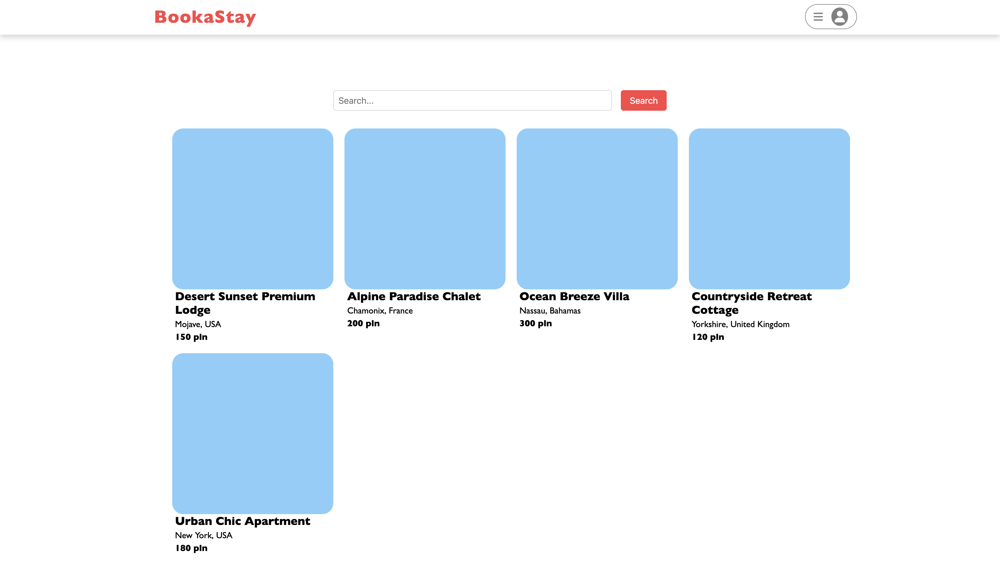
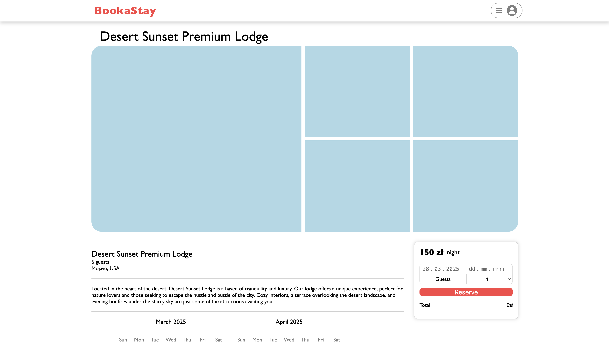
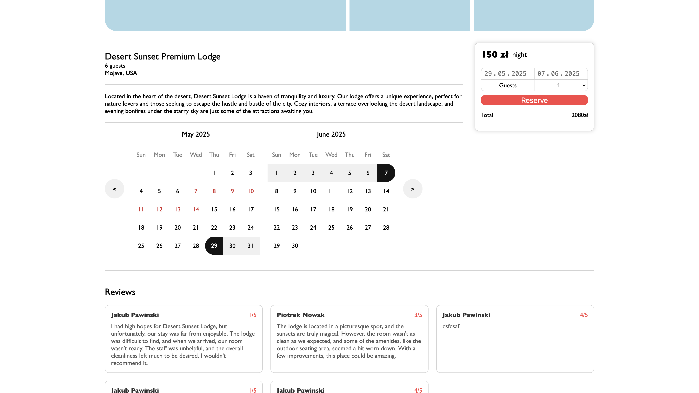
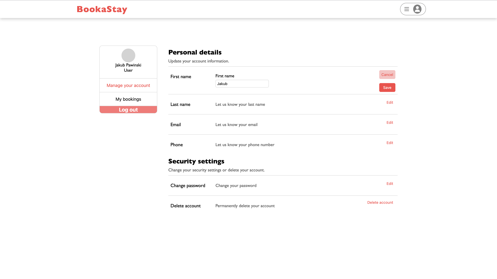
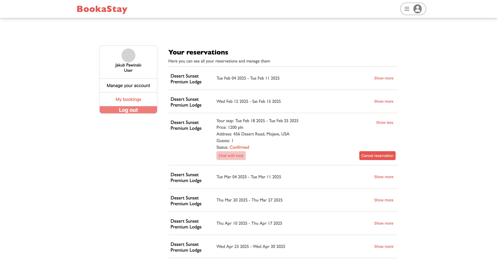
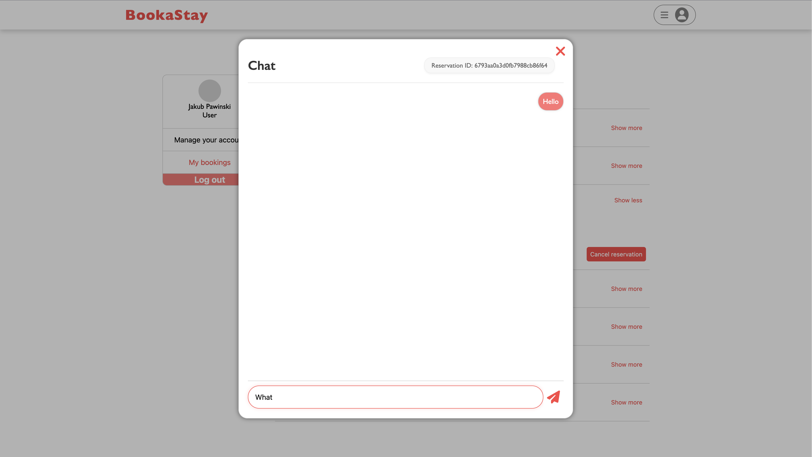
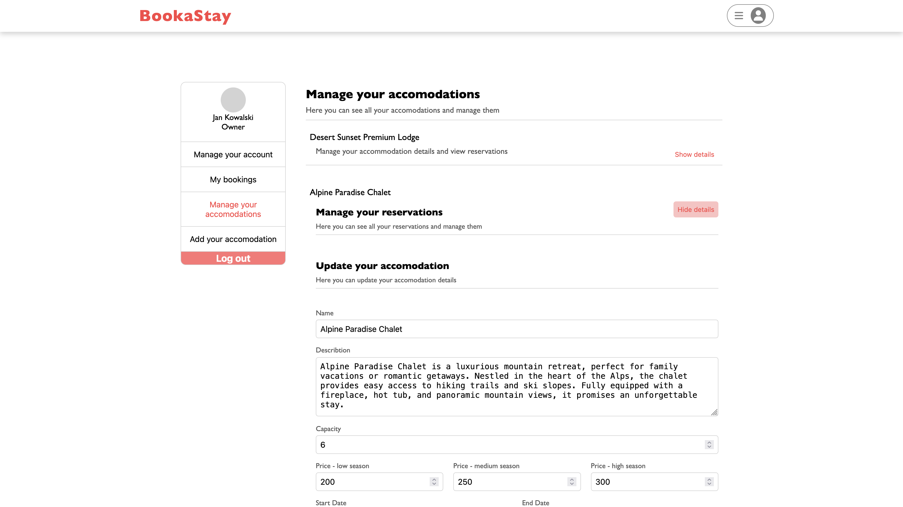
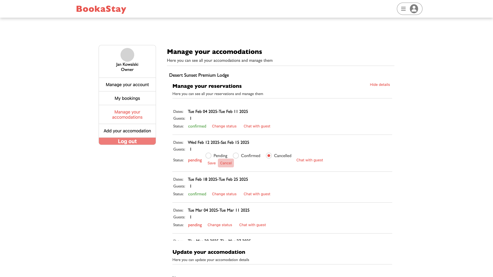
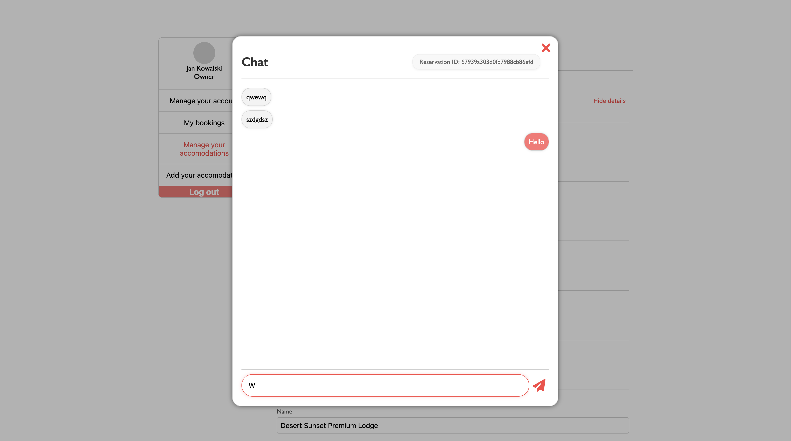

# Accommodation Booking System

## Project Overview

This project, developed as part of the Web Protocols course, is a comprehensive platform for booking holiday cottages. It provides tailored functionalities for both guests and cottage owners, leveraging modern web technologies and real-time communication protocols to deliver a seamless user experience.

## Key Features

### For Guests:

- **User Registration and Login**: Secure account creation and authentication.
- **Booking Management**: Effortless booking with automated price calculation.
- **Reservation Overview**: Access to current and past reservations.
- **Real-Time Communication**: Chat directly with cottage owners.
- **Reservation Cancellation**: Easy cancellation of bookings.
- **Notifications**: Stay informed about reservation status updates.

### For Cottage Owners:

- **Management Panel**: Centralized dashboard for managing reservations.
- **Reservation Approval**: Review and approve guest bookings.
- **Seasonal Pricing**: Configure pricing for low, medium, and high seasons.
- **Real-Time Chat**: Communicate instantly with guests.
- **Notifications**: Alerts for new reservations and updates.

## Screenshots

### Home Page

### Guest Dashboard

### Owner Managment Panel

### WebSocket Integration:

- **Real-Time Chat**: Instant messaging between guests and owners.
- **Live Updates**: Dynamic updates for accommodation reviews and booking calendars.

### MQTT Integration:

- **Reservation Notifications**: Real-time updates on reservation status changes.
- **Owner Alerts**: Immediate notifications for new bookings.
- **Data Forwarding**: Seamless integration with other components for email confirmations and status updates.

### SMTP Integration:

- **Email Notifications**: Automated reservation confirmation emails sent to registered users.

## Technology Stack

### Frontend:

- **React**: Component-based UI development.
- **Next.js**: Server-side rendering and routing.
- **Axios**: Simplified HTTP request handling.
- **Socket.io-client**: WebSocket communication for real-time features.
- **MQTT.js**: MQTT protocol integration.
- **SCSS**: Advanced styling with modularity.

### Backend:

- **Node.js**: High-performance server-side runtime.
- **Express.js**: REST API development framework.
- **MongoDB**: NoSQL database for scalable data storage.
- **Mongoose**: Object Data Modeling (ODM) for MongoDB.
- **Socket.io**: WebSocket server for real-time communication.
- **MQTT**: Lightweight messaging protocol for IoT, using the **HiveMQ** broker for reliable message delivery.
- **Nodemailer**: Email service for automated notifications.

## Author

**Jakub Pawiński**
